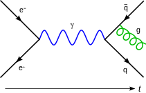

<table class="vertical-navbox nowraplinks plainlist">
<tbody>
<tr>
<th><a title="Quantum field theory" href="https://en.wikipedia.org/wiki/Quantum_field_theory">Quantum field theory</a></th>
</tr>
<tr>
<td>

<a title="Feynman diagram" href="https://en.wikipedia.org/wiki/Feynman_diagram">Feynman diagram</a>

</td>
</tr>
<tr>
<td><a title="History of quantum field theory" href="https://en.wikipedia.org/wiki/History_of_quantum_field_theory">History</a></td>
</tr>
<tr>
<td>

Background

<ul>
<li><a title="Field (physics)" href="https://en.wikipedia.org/wiki/Field_(physics)">Field theory</a></li>
<li><a title="Electromagnetism" href="https://en.wikipedia.org/wiki/Electromagnetism">Electromagnetism</a></li>
<li><a class="mw-redirect" title="Weak force" href="https://en.wikipedia.org/wiki/Weak_force">Weak force</a></li>
<li><a class="mw-redirect" title="Strong force" href="https://en.wikipedia.org/wiki/Strong_force">Strong force</a></li>
<li><a title="Quantum mechanics" href="https://en.wikipedia.org/wiki/Quantum_mechanics">Quantum mechanics</a></li>
<li><a title="Special relativity" href="https://en.wikipedia.org/wiki/Special_relativity">Special relativity</a></li>
<li><a title="General relativity" href="https://en.wikipedia.org/wiki/General_relativity">General relativity</a></li>
<li><a title="Gauge theory" href="https://en.wikipedia.org/wiki/Gauge_theory">Gauge theory</a></li>
</ul>

</td>
</tr>
<tr>
<td>

<a title="Symmetry (physics)" href="https://en.wikipedia.org/wiki/Symmetry_(physics)">Symmetries</a>

<ul>
<li><a title="Symmetry in quantum mechanics" href="https://en.wikipedia.org/wiki/Symmetry_in_quantum_mechanics">Symmetry in quantum mechanics</a></li>
<li><a class="mw-redirect" title="Charge conjugation" href="https://en.wikipedia.org/wiki/Charge_conjugation">C-symmetry</a></li>
<li><a title="Parity (physics)" href="https://en.wikipedia.org/wiki/Parity_(physics)">P-symmetry</a></li>
<li><a title="T-symmetry" href="https://en.wikipedia.org/wiki/T-symmetry">T-symmetry</a></li>
<li><a class="mw-redirect" title="Space translation symmetry" href="https://en.wikipedia.org/wiki/Space_translation_symmetry">Space translation symmetry</a></li>
<li><a title="Time translation symmetry" href="https://en.wikipedia.org/wiki/Time_translation_symmetry">Time translation symmetry</a></li>
<li><a class="mw-redirect" title="Rotation symmetry" href="https://en.wikipedia.org/wiki/Rotation_symmetry">Rotation symmetry</a></li>
<li><a class="mw-redirect" title="Lorentz symmetry" href="https://en.wikipedia.org/wiki/Lorentz_symmetry">Lorentz symmetry</a></li>
<li><a class="mw-redirect" title="Poincar&eacute; symmetry" href="https://en.wikipedia.org/wiki/Poincar%C3%A9_symmetry">Poincar&eacute; symmetry</a></li>
<li><a title="Gauge symmetry (mathematics)" href="https://en.wikipedia.org/wiki/Gauge_symmetry_(mathematics)">Gauge symmetry</a></li>
<li><a title="Explicit symmetry breaking" href="https://en.wikipedia.org/wiki/Explicit_symmetry_breaking">Explicit symmetry breaking</a></li>
<li><a title="Spontaneous symmetry breaking" href="https://en.wikipedia.org/wiki/Spontaneous_symmetry_breaking">Spontaneous symmetry breaking</a></li>
<li><a title="Yang&ndash;Mills theory" href="https://en.wikipedia.org/wiki/Yang%E2%80%93Mills_theory">Yang&ndash;Mills theory</a></li>
<li><a class="mw-redirect" title="Noether charge" href="https://en.wikipedia.org/wiki/Noether_charge">Noether charge</a></li>
<li><a class="mw-redirect" title="Topological charge" href="https://en.wikipedia.org/wiki/Topological_charge">Topological charge</a></li>
</ul>

</td>
</tr>
<tr>
<td>

Tools

<ul>
<li><a title="Anomaly (physics)" href="https://en.wikipedia.org/wiki/Anomaly_(physics)">Anomaly</a></li>
<li><a title="Crossing (physics)" href="https://en.wikipedia.org/wiki/Crossing_(physics)">Crossing</a></li>
<li><a title="Effective field theory" href="https://en.wikipedia.org/wiki/Effective_field_theory">Effective field theory</a></li>
<li><a title="Vacuum expectation value" href="https://en.wikipedia.org/wiki/Vacuum_expectation_value">Expectation value</a></li>
<li><a class="mw-redirect" title="Ghosts (physics)" href="https://en.wikipedia.org/wiki/Ghosts_(physics)">Ghost fields</a></li>
<li><a title="Faddeev&ndash;Popov ghost" href="https://en.wikipedia.org/wiki/Faddeev%E2%80%93Popov_ghost">Faddeev&ndash;Popov ghosts</a></li>
<li><a title="Feynman diagram" href="https://en.wikipedia.org/wiki/Feynman_diagram">Feynman diagram</a></li>
<li><a title="Lattice gauge theory" href="https://en.wikipedia.org/wiki/Lattice_gauge_theory">Lattice gauge theory</a></li>
<li><a title="LSZ reduction formula" href="https://en.wikipedia.org/wiki/LSZ_reduction_formula">LSZ reduction formula</a></li>
<li><a title="Partition function (quantum field theory)" href="https://en.wikipedia.org/wiki/Partition_function_(quantum_field_theory)">Partition function</a></li>
<li><a title="Propagator" href="https://en.wikipedia.org/wiki/Propagator">Propagator</a></li>
<li><a title="Quantization (physics)" href="https://en.wikipedia.org/wiki/Quantization_(physics)">Quantization</a></li>
<li><a title="Regularization (physics)" href="https://en.wikipedia.org/wiki/Regularization_(physics)">Regularization</a></li>
<li><a title="Renormalization" href="https://en.wikipedia.org/wiki/Renormalization">Renormalization</a></li>
<li><a title="Vacuum state" href="https://en.wikipedia.org/wiki/Vacuum_state">Vacuum state</a></li>
<li><a title="Wick's theorem" href="https://en.wikipedia.org/wiki/Wick%27s_theorem">Wick's theorem</a></li>
<li><a title="Wightman axioms" href="https://en.wikipedia.org/wiki/Wightman_axioms">Wightman axioms</a></li>
<li><a title="Feynman parametrization" href="https://en.wikipedia.org/wiki/Feynman_parametrization">Feynman parametrization</a></li>
</ul>

</td>
</tr>
<tr>
<td>

Equations

<ul>
<li><a title="Dirac equation" href="https://en.wikipedia.org/wiki/Dirac_equation">Dirac equation</a></li>
<li><a title="Klein&ndash;Gordon equation" href="https://en.wikipedia.org/wiki/Klein%E2%80%93Gordon_equation">Klein&ndash;Gordon equation</a></li>
<li><a title="Proca action" href="https://en.wikipedia.org/wiki/Proca_action">Proca equations</a></li>
<li><a title="Wheeler&ndash;DeWitt equation" href="https://en.wikipedia.org/wiki/Wheeler%E2%80%93DeWitt_equation">Wheeler&ndash;DeWitt equation</a></li>
<li><a title="Bargmann&ndash;Wigner equations" href="https://en.wikipedia.org/wiki/Bargmann%E2%80%93Wigner_equations">Bargmann&ndash;Wigner equations</a></li>
<li><a title="Joos&ndash;Weinberg equation" href="https://en.wikipedia.org/wiki/Joos%E2%80%93Weinberg_equation">Joos&ndash;Weinberg equation</a></li>
<li><a title="Weyl equation" href="https://en.wikipedia.org/wiki/Weyl_equation">Weyl equation</a></li>
</ul>

</td>
</tr>
<tr>
<td>

<a title="Standard Model" href="https://en.wikipedia.org/wiki/Standard_Model">Standard Model</a>

<ul>
<li><a title="Quantum electrodynamics" href="https://en.wikipedia.org/wiki/Quantum_electrodynamics">Quantum electrodynamics</a></li>
<li><a title="Electroweak interaction" href="https://en.wikipedia.org/wiki/Electroweak_interaction">Electroweak interaction</a></li>
<li><a title="Quantum chromodynamics" href="https://en.wikipedia.org/wiki/Quantum_chromodynamics">Quantum chromodynamics</a></li>
<li><a title="Higgs mechanism" href="https://en.wikipedia.org/wiki/Higgs_mechanism">Higgs mechanism</a></li>
</ul>

</td>
</tr>
<tr>
<td>

Incomplete theories

<ul>
<li><a title="Topological quantum field theory" href="https://en.wikipedia.org/wiki/Topological_quantum_field_theory">Topological quantum field theory</a></li>
<li><a title="String theory" href="https://en.wikipedia.org/wiki/String_theory">String theory</a></li>
<li><a title="Superstring theory" href="https://en.wikipedia.org/wiki/Superstring_theory">Superstring theory</a></li>
<li><a class="mw-redirect" title="M-Theory" href="https://en.wikipedia.org/wiki/M-Theory">M-Theory</a></li>
<li><a title="Supersymmetry" href="https://en.wikipedia.org/wiki/Supersymmetry">Supersymmetry</a></li>
<li><a title="Supergravity" href="https://en.wikipedia.org/wiki/Supergravity">Supergravity</a></li>
<li><a title="Technicolor (physics)" href="https://en.wikipedia.org/wiki/Technicolor_(physics)">Technicolor</a></li>
<li><a title="Theory of everything" href="https://en.wikipedia.org/wiki/Theory_of_everything">Theory of everything</a></li>
<li><a title="Quantum gravity" href="https://en.wikipedia.org/wiki/Quantum_gravity">Quantum gravity</a></li>
</ul>

</td>
</tr>
<tr>
<td>

Scientists

<ul>
<li><a title="Stephen L. Adler" href="https://en.wikipedia.org/wiki/Stephen_L._Adler">Adler</a></li>
<li><a class="mw-redirect" title="Philip Warren Anderson" href="https://en.wikipedia.org/wiki/Philip_Warren_Anderson">Anderson</a></li>
<li><a title="Hans Bethe" href="https://en.wikipedia.org/wiki/Hans_Bethe">Bethe</a></li>
<li><a title="Nikolay Bogolyubov" href="https://en.wikipedia.org/wiki/Nikolay_Bogolyubov">Bogoliubov</a></li>
<li><a title="Sidney Coleman" href="https://en.wikipedia.org/wiki/Sidney_Coleman">Coleman</a></li>
<li><a title="Curtis Callan" href="https://en.wikipedia.org/wiki/Curtis_Callan">Callan</a></li>
<li><a title="Bryce DeWitt" href="https://en.wikipedia.org/wiki/Bryce_DeWitt">DeWitt</a></li>
<li><a title="Paul Dirac" href="https://en.wikipedia.org/wiki/Paul_Dirac">Dirac</a></li>
<li><a title="Freeman Dyson" href="https://en.wikipedia.org/wiki/Freeman_Dyson">Dyson</a></li>
<li><a title="Enrico Fermi" href="https://en.wikipedia.org/wiki/Enrico_Fermi">Fermi</a></li>
<li><a title="Richard Feynman" href="https://en.wikipedia.org/wiki/Richard_Feynman">Feynman</a></li>
<li><a title="Markus Fierz" href="https://en.wikipedia.org/wiki/Markus_Fierz">Fierz</a></li>
<li><a title="Vladimir Fock" href="https://en.wikipedia.org/wiki/Vladimir_Fock">Fock</a></li>
<li><a title="J&uuml;rg Fr&ouml;hlich" href="https://en.wikipedia.org/wiki/J%C3%BCrg_Fr%C3%B6hlich">Fr&ouml;hlich</a></li>
<li><a title="Murray Gell-Mann" href="https://en.wikipedia.org/wiki/Murray_Gell-Mann">Gell-Mann</a></li>
<li><a title="Jeffrey Goldstone" href="https://en.wikipedia.org/wiki/Jeffrey_Goldstone">Goldstone</a></li>
<li><a title="David Gross" href="https://en.wikipedia.org/wiki/David_Gross">Gross</a></li>
<li><a title="Werner Heisenberg" href="https://en.wikipedia.org/wiki/Werner_Heisenberg">Heisenberg</a></li>
<li><a title="Gerard 't Hooft" href="https://en.wikipedia.org/wiki/Gerard_%27t_Hooft">'t Hooft</a></li>
<li><a title="Roman Jackiw" href="https://en.wikipedia.org/wiki/Roman_Jackiw">Jackiw</a></li>
<li><a title="Pascual Jordan" href="https://en.wikipedia.org/wiki/Pascual_Jordan">Jordan</a></li>
<li><a title="Lev Landau" href="https://en.wikipedia.org/wiki/Lev_Landau">Landau</a></li>
<li><a title="Tsung-Dao Lee" href="https://en.wikipedia.org/wiki/Tsung-Dao_Lee">Lee</a></li>
<li><a title="Harry Lehmann" href="https://en.wikipedia.org/wiki/Harry_Lehmann">Lehmann</a></li>
<li><a title="Stanley Mandelstam" href="https://en.wikipedia.org/wiki/Stanley_Mandelstam">Mandelstam</a></li>
<li><a title="Ettore Majorana" href="https://en.wikipedia.org/wiki/Ettore_Majorana">Majorana</a></li>
<li><a title="Yoichiro Nambu" href="https://en.wikipedia.org/wiki/Yoichiro_Nambu">Nambu</a></li>
<li><a title="Giorgio Parisi" href="https://en.wikipedia.org/wiki/Giorgio_Parisi">Parisi</a></li>
<li><a title="Alexander Markovich Polyakov" href="https://en.wikipedia.org/wiki/Alexander_Markovich_Polyakov">Polyakov</a></li>
<li><a title="Abdus Salam" href="https://en.wikipedia.org/wiki/Abdus_Salam">Salam</a></li>
<li><a title="Julian Schwinger" href="https://en.wikipedia.org/wiki/Julian_Schwinger">Schwinger</a></li>
<li><a title="Tony Skyrme" href="https://en.wikipedia.org/wiki/Tony_Skyrme">Skyrme</a></li>
<li><a title="Ernst Stueckelberg" href="https://en.wikipedia.org/wiki/Ernst_Stueckelberg">Stueckelberg</a></li>
<li><a title="Kurt Symanzik" href="https://en.wikipedia.org/wiki/Kurt_Symanzik">Symanzik</a></li>
<li><a title="Shin'ichirō Tomonaga" href="https://en.wikipedia.org/wiki/Shin%27ichir%C5%8D_Tomonaga">Tomonaga</a></li>
<li><a class="mw-redirect" title="Martinus Veltman" href="https://en.wikipedia.org/wiki/Martinus_Veltman">Veltman</a></li>
<li><a title="Steven Weinberg" href="https://en.wikipedia.org/wiki/Steven_Weinberg">Weinberg</a></li>
<li><a title="Victor Weisskopf" href="https://en.wikipedia.org/wiki/Victor_Weisskopf">Weisskopf</a></li>
<li><a title="Hermann Weyl" href="https://en.wikipedia.org/wiki/Hermann_Weyl">Weyl</a></li>
<li><a title="Frank Wilczek" href="https://en.wikipedia.org/wiki/Frank_Wilczek">Wilczek</a></li>
<li><a title="Kenneth G. Wilson" href="https://en.wikipedia.org/wiki/Kenneth_G._Wilson">Wilson</a></li>
<li><a title="Edward Witten" href="https://en.wikipedia.org/wiki/Edward_Witten">Witten</a></li>
<li><a title="Yang Chen-Ning" href="https://en.wikipedia.org/wiki/Yang_Chen-Ning">Yang</a></li>
<li><a title="Hideki Yukawa" href="https://en.wikipedia.org/wiki/Hideki_Yukawa">Yukawa</a></li>
<li><a title="Wolfhart Zimmermann" href="https://en.wikipedia.org/wiki/Wolfhart_Zimmermann">Zimmermann</a></li>
<li><a title="Jean Zinn-Justin" href="https://en.wikipedia.org/wiki/Jean_Zinn-Justin">Zinn-Justin</a></li>
</ul>

</td>
</tr>
</tbody>
</table>
 

<h2> Books: </h2>

<ul>
                                <li><a target="_blank" href="https://github.com/manjunath5496/Quantum-Mechanics-Books/blob/master/qm(1).pdf" style="text-decoration:none;">The Dancing Wu Li Masters: An Overview of the New Physics </a></li>
                                <li><a target="_blank" href="https://github.com/manjunath5496/Quantum-Mechanics-Books/blob/master/qm(2).pdf" style="text-decoration:none;">QUANTUM PHYSICS of Atoms, Molecules, Solids, Nuclei, and Particles</a></li>
                                <li><a target="_blank" href="https://github.com/manjunath5496/Quantum-Mechanics-Books/blob/master/qm(3).pdf" style="text-decoration:none;">Quantum Physics For Dummies</a></li>
                               
<li><a target="_blank" href="https://github.com/manjunath5496/Quantum-Mechanics-Books/blob/master/qm(4).pdf" style="text-decoration:none;">In Search of Schrodinger's Cat</a></li>
                                <li><a target="_blank" href="https://github.com/manjunath5496/Quantum-Mechanics-Books/blob/master/qm(5).pdf" style="text-decoration:none;"> QED: The Strange Theory of Light and Matter </a></li>
                                
 <li><a target="_blank" href="https://github.com/manjunath5496/Quantum-Mechanics-Books/blob/master/qm(6).pdf" style="text-decoration:none;">Quantum Mechanics Made Simple: Lecture Notes</a></li>
                          
<li><a target="_blank" href="https://github.com/manjunath5496/Quantum-Mechanics-Books/blob/master/qm(7).pdf" style="text-decoration:none;">Lecture Notes in Quantum Mechanics </a></li>
                                <li><a target="_blank" href="https://github.com/manjunath5496/Quantum-Mechanics-Books/blob/master/qm(8).pdf" style="text-decoration:none;">The Theoretical Minimum: What You Need to Know to Start Doing Physics</a></li>
                                <li><a target="_blank" href="https://github.com/manjunath5496/Quantum-Mechanics-Books/blob/master/qm(9).pdf" style="text-decoration:none;">The Fabric of Reality </a></li>
                                
<li><a target="_blank" href="https://github.com/manjunath5496/Quantum-Mechanics-Books/blob/master/qm(10).pdf" style="text-decoration:none;">Theoretical Concepts of Quantum Mechanics </a></li>  
        
<li><a target="_blank" href="https://github.com/manjunath5496/Quantum-Mechanics-Books/blob/master/qm(11).pdf" style="text-decoration:none;">The Strangest Man: The Hidden Life of Paul Dirac, Mystic of the Atom </a></li>
                                <li><a target="_blank" href="https://github.com/manjunath5496/Quantum-Mechanics-Books/blob/master/qm(12).pdf" style="text-decoration:none;"> The Picture Book of Quantum Mechanics</a></li>
 <li><a target="_blank" href="https://github.com/manjunath5496/Quantum-Mechanics-Books/blob/master/qm(13).pdf" style="text-decoration:none;">The Elegant Universe</a></li> 
 
 <li><a target="_blank" href="https://github.com/manjunath5496/Quantum-Mechanics-Books/blob/master/qm(14).pdf" style="text-decoration:none;">The Hidden Reality: Parallel Universes and the Deep Laws of the Cosmos</a></li>
                                <li><a target="_blank" href="https://github.com/manjunath5496/Quantum-Mechanics-Books/blob/master/qm(15).pdf" style="text-decoration:none;">Quantum Computation and Quantum Information</a></li>

  
 <li><a target="_blank" href="https://github.com/manjunath5496/Quantum-Mechanics-Books/blob/master/qm(16).pdf" style="text-decoration:none;">The Beginning of Infinity: Explanations that Transform the World</a></li>
                                <li><a target="_blank" href="https://github.com/manjunath5496/Quantum-Mechanics-Books/blob/master/qm(17).pdf" style="text-decoration:none;">How to Teach Physics to Your Dog </a></li>
                                
  <li><a target="_blank" href="https://github.com/manjunath5496/Quantum-Mechanics-Books/blob/master/qm(18).pdf" style="text-decoration:none;">Quantum Mechanics Demystified</a></li>
                                <li><a target="_blank" href="https://github.com/manjunath5496/Quantum-Mechanics-Books/blob/master/qm(19).pdf" style="text-decoration:none;">Quantum: Einstein, Bohr, And The Great Debate About The Nature Of Reality </a></li>
         <li><a target="_blank" href="https://github.com/manjunath5496/Quantum-Mechanics-Books/blob/master/qm(20).pdf" style="text-decoration:none;">The Mathematical Foundations of Quantum Mechanics </a></li>                                                                         <li><a target="_blank" href="https://github.com/manjunath5496/Quantum-Mechanics-Books/blob/master/qm(21).pdf" style="text-decoration:none;">The Field: The Quest for the Secret Force of the Universe </a></li>
         <li><a target="_blank" href="https://github.com/manjunath5496/Quantum-Mechanics-Books/blob/master/qm(22).rar" style="text-decoration:none;">Quantum Mechanics and Path Integrals </a></li>     
                                
                                
                                
                                
                                
                                
                                
                                
 
 </ul>
